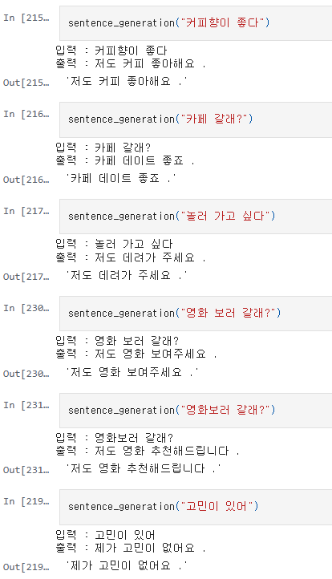
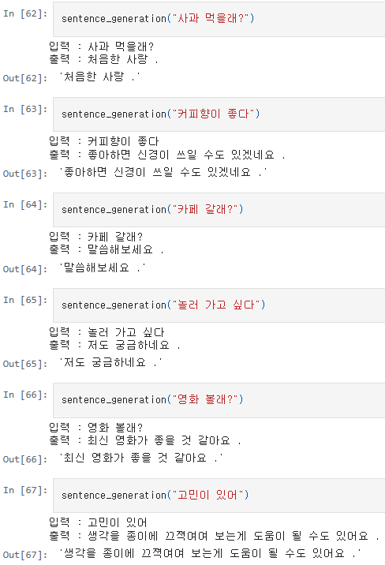
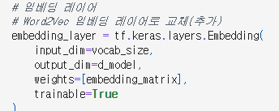
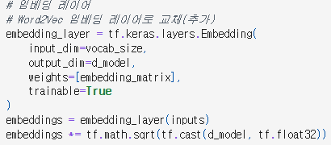
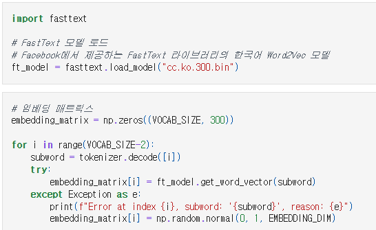
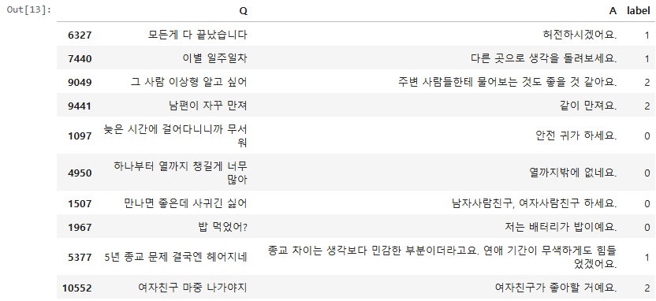
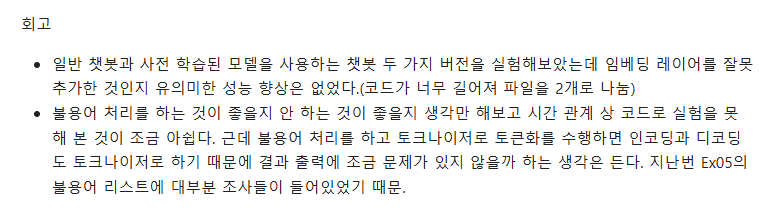
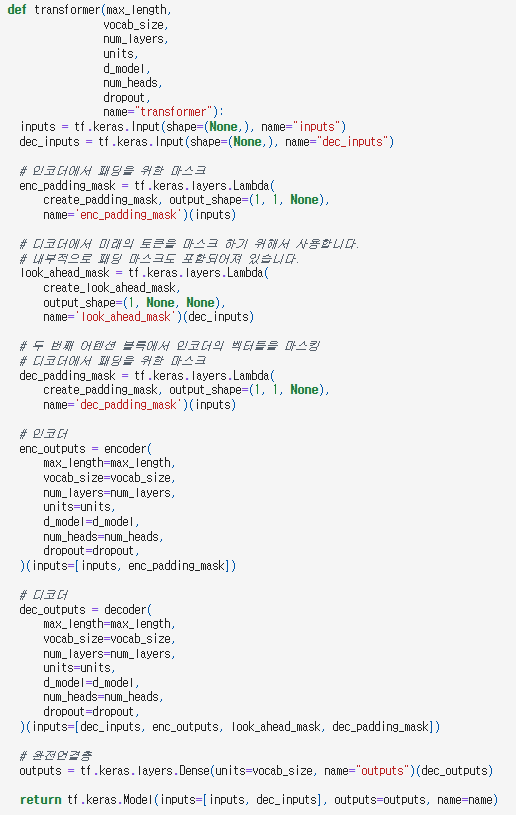

# AIFFEL Campus Online Code Peer Review Templete
- 코더 : 황수미미
- 리뷰어 : 임한결.


# PRT(Peer Review Template)
- [O]  **1. 주어진 문제를 해결하는 완성된 코드가 제출되었나요?**
    - 문제에서 요구하는 최종 결과물이 첨부되었는지 확인
        - 중요! 해당 조건을 만족하는 부분을 캡쳐해 근거로 첨부
    - 데이터 전처리, 트랜스포머 모델 구현, 한국어 챗봇 모델 테스트까지의 일련의 과정들이 모두 성공적으로 완료되었고, 두 개의 비교 모델을 통해 성능을 비교하는 과정까지 있었습니다.
    
    
    
- [O]  **2. 전체 코드에서 가장 핵심적이거나 가장 복잡하고 이해하기 어려운 부분에 작성된 
주석 또는 doc string을 보고 해당 코드가 잘 이해되었나요?**
    - 해당 코드 블럭을 왜 핵심적이라고 생각하는지 확인
    - 해당 코드 블럭에 doc string/annotation이 달려 있는지 확인
    - 해당 코드의 기능, 존재 이유, 작동 원리 등을 기술했는지 확인
    - 주석을 보고 코드 이해가 잘 되었는지 확인
        - 중요! 잘 작성되었다고 생각되는 부분을 캡쳐해 근거로 첨부
    - 지난 노드에서 배웠던 word2vec을 트랜스포머 모델에 이식하여, 사전훈련된 vocab으로 모델을 훈련하는 부분을 주석을 통해 잘 설명하고 있습니다.
    
    
    
        
- [O]  **3. 에러가 난 부분을 디버깅하여 문제를 해결한 기록을 남겼거나
새로운 시도 또는 추가 실험을 수행해봤나요?**
    - 문제 원인 및 해결 과정을 잘 기록하였는지 확인
    - 프로젝트 평가 기준에 더해 추가적으로 수행한 나만의 시도, 
    실험이 기록되어 있는지 확인
        - 중요! 잘 작성되었다고 생각되는 부분을 캡쳐해 근거로 첨부
    - 학습에서 아쉬움이 있었던 부분을 찾아내기 위해 데이터의 형태를 자세히 살펴보고, 데이터의 품질에 문제가 있었음을 잘 확인할 수 있었습니다.
    

- [O]  **4. 회고를 잘 작성했나요?**
    - 주어진 문제를 해결하는 완성된 코드 내지 프로젝트 결과물에 대해
    배운점과 아쉬운점, 느낀점 등이 기록되어 있는지 확인
    - 전체 코드 실행 플로우를 그래프로 그려서 이해를 돕고 있는지 확인
        - 중요! 잘 작성되었다고 생각되는 부분을 캡쳐해 근거로 첨부
    - 회고를 통해 비교 모델들의 성능이 어떻게 변화되었는지를 기록하였고, 추가적으로 불용어 처리가 진행된다면 어느 부분에 어떻게 진행될 것인지에 대한 고려를 회고에 기록하였습니다.
    
        
- [O]  **5. 코드가 간결하고 효율적인가요?**
    - 파이썬 스타일 가이드 (PEP8) 를 준수하였는지 확인
    - 코드 중복을 최소화하고 범용적으로 사용할 수 있도록 함수화/모듈화했는지 확인
        - 중요! 잘 작성되었다고 생각되는 부분을 캡쳐해 근거로 첨부
    - 트랜스포머 모델을 함수화하는 부분에서, 모델의 부품이 되는 인코더나 디코더 등의 블럭을 잘 모듈화하고 활용한 모습을 볼 수 있었습니다.
    


# 회고(참고 링크 및 코드 개선)
```
# 리뷰어의 회고를 작성합니다.
# 코드 리뷰 시 참고한 링크가 있다면 링크와 간략한 설명을 첨부합니다.
# 코드 리뷰를 통해 개선한 코드가 있다면 코드와 간략한 설명을 첨부합니다.

사전학습된 word2vec를 사용하여 모델을 훈련시키는 새로운 시도가 인상깊었습니다.
코드 자체도 깔끔하고, 전반적인 내용에 대해서 잘 이해하고 있다고 생각이 들었습니다.
테스트 결과를 확인할 때에도, 여러 질문들을 쿼리로 줘서 모델이 잘 이해하는 질문과 잘 이해하지 못하는 질문을 비교하는 것도 굉장히 좋았습니다.
추가적으로, 학습이 될 때 history를 활용한 log 시각화 등을 통해 학습이 잘 수렴되는지를 확인할 수 있으면 코드가 조금 더 개선될 수 있지 않을까 생각이 들었습니다.

```

