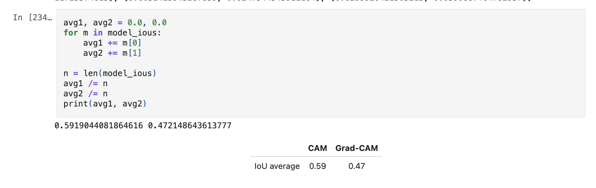
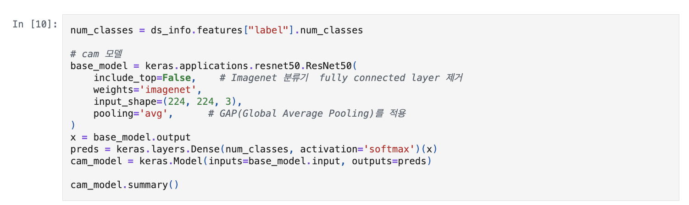
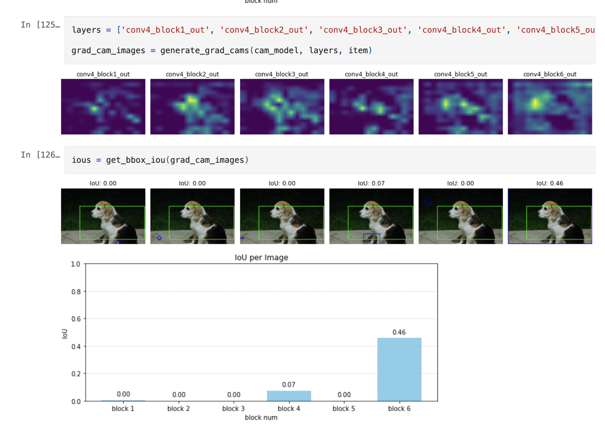
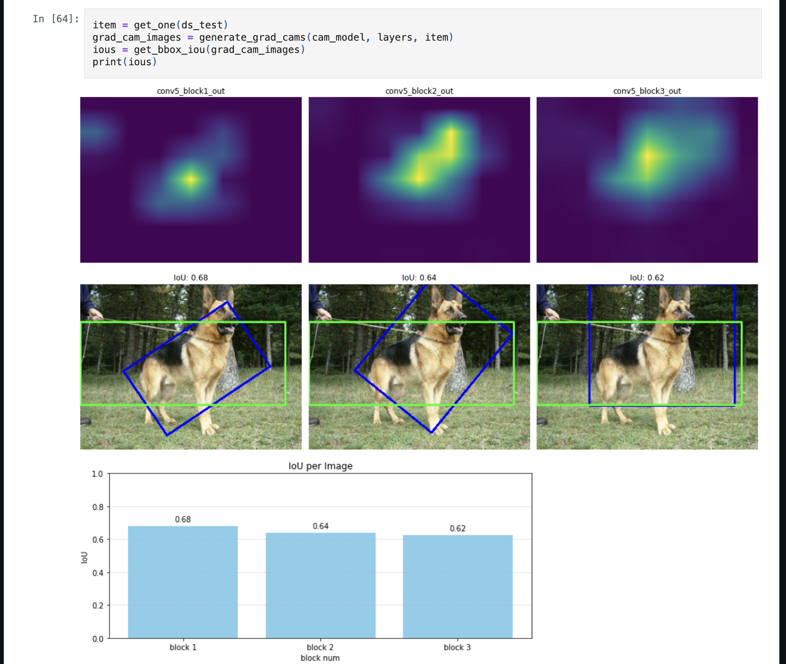
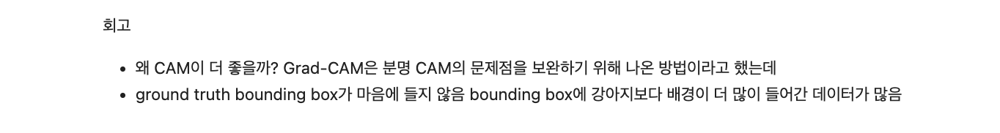
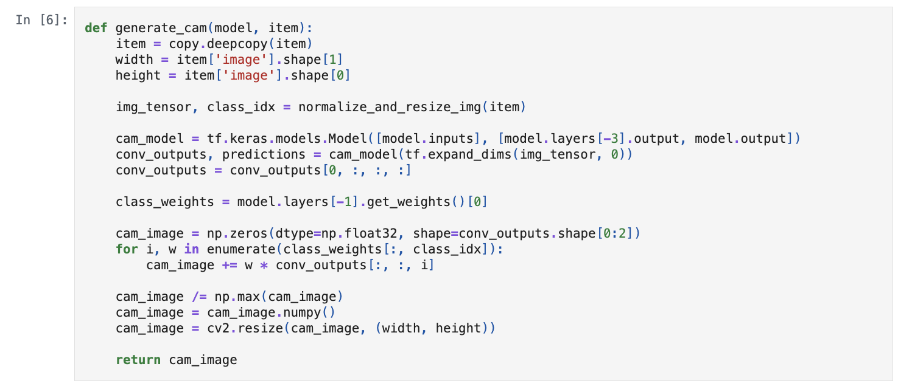

# AIFFEL Campus Online Code Peer Review Templete
- 코더 : 황수미.
- 리뷰어 : 신기성.


# PRT(Peer Review Template)
- [o]  **1. 주어진 문제를 해결하는 완성된 코드가 제출되었나요?**
    -네,  문제에서 요구하는 최종 결과물이 첨부되었는지 확인했습니다.
        - 중요! 해당 조건을 만족하는 부분을 캡쳐해 근거로 첨부
	
    
- [o]  **2. 전체 코드에서 가장 핵심적이거나 가장 복잡하고 이해하기 어려운 부분에 작성된 
주석 또는 doc string을 보고 해당 코드가 잘 이해되었나요?**
    - 해당 코드 블럭을 왜 핵심적이라고 생각한 이유는결과를 도출하기 위한  모델의 핵심이 되기 때문입니다.
    - 네, 해당 코드 블럭에 doc string/annotation이 달려 있는지 확인하였습니다.
    - 해당 코드의 기능, 존재 이유, 작동 원리 등을 간단하게 annotate 하였습니다.
    - 네 주석을 보고 이해 할 수 있다고 생각합니다.
        - 중요! 잘 작성되었다고 생각되는 부분을 캡쳐해 근거로 첨부
        

- [o]  **3. 에러가 난 부분을 디버깅하여 문제를 해결한 기록을 남겼거나
새로운 시도 또는 추가 실험을 수행해봤나요?**
    - 네, 문제 원인 및 해결 과정을 잘 기록하였는지 확인하였고,
    - 프로젝트 평가 기준에 더해 추가적으로 수행한 나만의 시도, 
    실험이 기록되어 있는지 또한 확인 하였습니다.
        - 중요! 잘 작성되었다고 생각되는 부분을 캡쳐해 근거로 첨부
        
	

- [o]  **4. 회고를 잘 작성했나요?**
    - 네, 주어진 문제를 해결하는 완성된 코드 내지 프로젝트 결과물에 대해
    배운점과 아쉬운점, 느낀점 등이 기록되어 있는지 확인하였습니다.
        - 중요! 잘 작성되었다고 생각되는 부분을 캡쳐해 근거로 첨부
	        

- [o]  **5. 코드가 간결하고 효율적인가요?**
    - 네, 파이썬 스타일 가이드 (PEP8) 를 준수하였습니다. 
    - 네 코드 중복을 최소화하고 범용적으로 사용할 수 있도록 함수화/모듈화했는지 하였습니다.
        - 중요! 잘 작성되었다고 생각되는 부분을 캡쳐해 근거로 첨부
	

# 회고(참고 링크 및 코드 개선)
```
# 여러가지 모델을 시도 함으로써  시각화 부분에서 heatmap 으로만 시각화 한게 아니라 bar graph를 사용해서,시도한 부분이 인상 깊었습니다. 
# 코드 리뷰:  https://www.geeksforgeeks.org/bar-plot-in-matplotlib/.
```

